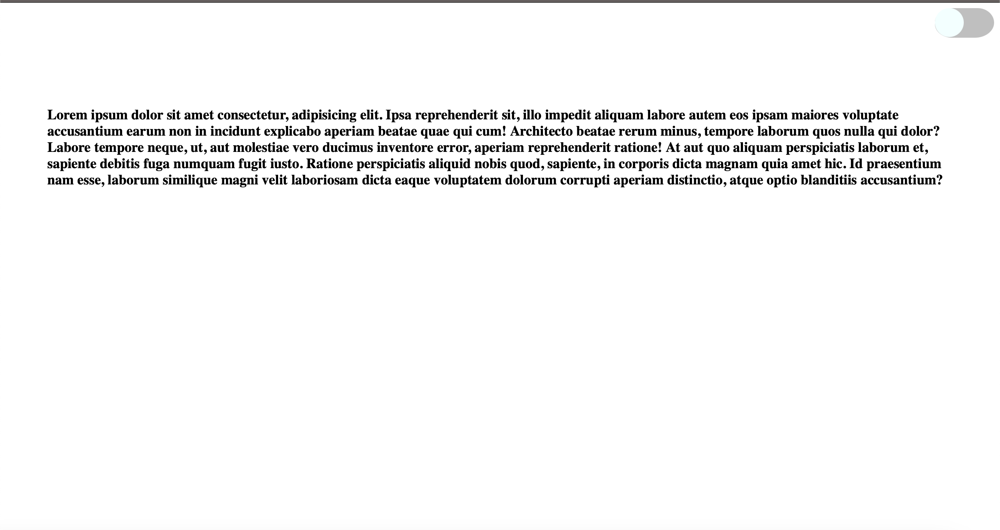
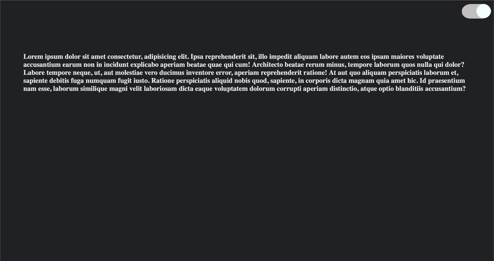

### Theme Changer using vanila Javascript

>On clicking on the toggle button, the theme of the web page changes. It toggle between dark mode and normal mode. 

## live link - [click here](https://themechanger-js-karanch.netlify.app)

## Time taken - 1hrs

### Screenshots 

